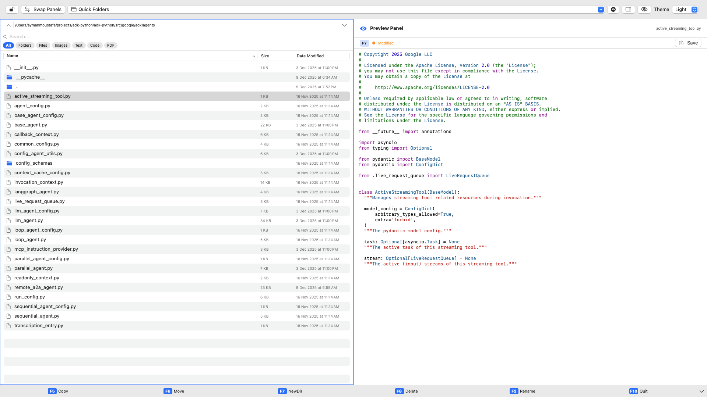

# <span style="color:#4DA3FF;">🚀 Kommanda — Dual-Pane File Manager for macOS</span>

Kommanda is a fast, modern, **dual-pane file manager** inspired by the legendary Norton Commander — but redesigned for macOS with **SwiftUI**, smooth animations, real-time previews, and a clean interface optimized for productivity.

If you work with files all day, Kommanda will feel like a superpower.  
If you're nostalgic for NC-style efficiency, Kommanda will feel like home.

---

## <span style="color:#4DA3FF;">✨ Key Features</span>

### 🔷 **Dual-Pane Navigation**
Navigate two folders at once.  
Copy, move, and compare files *without switching windows.*

### 🔍 **Instant Search & Filters**
Filter by:
- **All**
- **Files**
- **Folders**
- **Hidden Items**

Search is live, fast, and updates instantly.

### 🖼️ **Hover File Preview**
Hold your mouse over a file and Kommanda shows:
- Images  
- Text  
- PDFs  
- And more  

No clicks required.

### 🎨 **Themes (Including Norton Commander Mode)**
Choose your style:
- **Modern macOS**
- **Dark Mode**
- **NC Blue Theme** (full classic vibes)

### ⚡ **Smart File Operations**
Perform essential actions quickly:
- Copy  
- Move  
- Rename  
- New folder  
- Delete  
- Reveal in Finder  

Designed to minimize friction and maximize flow.

---

## <span style="color:#4DA3FF;">🛠️ Technologies</span>
Kommanda is built entirely with:

- **SwiftUI**
- **FileManager APIs**
- **Modern multi-pane architecture**
- **macOS 15+ SDK**

This keeps the app lightweight, reliable, and fast.

---

## <span style="color:#FF6B6B;">📣 Support & Issue Reporting</span>

If you experience a bug or need help, **please open an issue**.  
This helps improve Kommanda for everyone.

### **👉 Support Email**
**ayman3000@gmail.com**

### **👉 What to include in your support request**
Please copy/paste the following checklist into the issue:

```text
Issue Summary:
(What happened?)

Steps to Reproduce:
(How can we reproduce the problem?)

Expected Behavior:
(What you expected to happen)

Actual Behavior:
(What actually happened)

System Info:
- macOS version:
- Kommanda version:
- CPU (Intel or Apple Silicon):
- Anything else helpful:
```
## Screenshots


